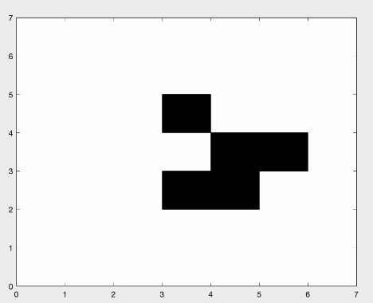

# Conway's Game of Life - MATLAB Simulation

This project implements Conway's Game of Life, a cellular automaton devised by the mathematician John Conway in 1970, using MATLAB. The simulation demonstrates the evolution of a 7x7 grid universe over 56 generations with periodic boundary conditions.

## Description

The Game of Life is a zero-player game where an initial configuration of cells evolves over time based on simple rules. The universe is a 2D grid of cells, each of which can be either alive or dead. The state of the universe changes in discrete steps called generations, where the future state of each cell depends on the number of alive neighbors it has.

In this project, a 7x7 grid is initialized with a **glider pattern**. The simulation runs for 56 generations, displaying the evolution of the grid in an animated figure.

### Rules of the Game of Life:
1. A living cell with fewer than 2 live neighbors dies (underpopulation).
2. A living cell with 2 or 3 live neighbors survives.
3. A living cell with more than 3 live neighbors dies (overpopulation).
4. A dead cell with exactly 3 live neighbors becomes alive (reproduction).

The grid is treated as if it wraps around itself (periodic boundary conditions), meaning cells on the edges are considered adjacent to those on the opposite edges.

## Features

- **Glider Pattern**: The simulation starts with a well-known **glider** configuration.
- **Periodic Boundary Conditions**: The edges of the universe wrap around, creating a seamless evolution of the cells.
- **Visualization**: The simulation is animated in MATLAB's figure window, updating the grid every 0.1 seconds.

## Usage

1. Open MATLAB.
2. Run the script file `yl_game_of_life.m` to begin the simulation.
3. Observe how the glider pattern moves diagonally and wraps around the universe over 56 generations.

## References

- [Conway's Game of Life (Wikipedia)](https://en.wikipedia.org/wiki/Conway%27s_Game_of_Life)
- [MATLAB Documentation](https://www.mathworks.com/help/matlab/)

